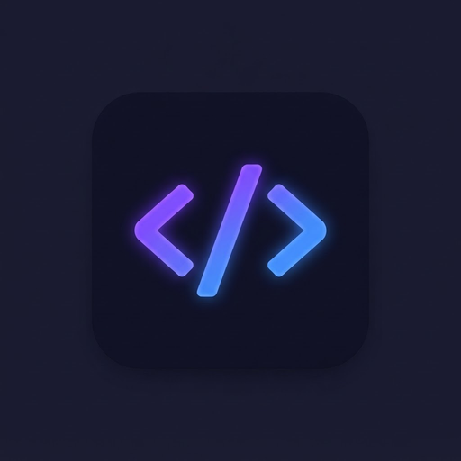

<div align="center">
  

  <h1>Thcode · Acode Editor</h1>
  <p><b>Editor de código para Android, com 10 bots de IA integrados</b></p>

  <a href="https://github.com/rlkbiloga-coder/acode_original/releases"></a>
  <a href="https://github.com/rlkbiloga-coder/acode_original/actions"></a>
  <a href="LICENSE"></a>
  <a href="https://rlkbiloga-coder.github.io/acode_original/"></a>
  <a href="https://github.com/rlkbiloga-coder/acode_original/releases/tag/latest-apk"></a>
  <a href="https://github.com/rlkbiloga-coder/acode_original/blob/main/CONTRIBUTING.md"></a>
  <a href="https://github.com/rlkbiloga-coder/acode_original/stargazers"></a>
  <a href="https://github.com/rlkbiloga-coder/acode_original/network/members"></a>
  <a href="https://github.com/rlkbiloga-coder/acode_original/commits/main"></a>
</div>

---

## Visão geral

Editor de código mobile completo para criar sites e programar em qualquer lugar, direto do celular. Edita HTML, CSS, JavaScript, Python, Java e dezenas de outras linguagens, com preview em tempo real, console embutido, terminal e plugins.

É um fork avançado do editor de código aberto Acode, mantido de forma independente, com a interface do app original preservada e a adição de um painel de IA próprio.

Site oficial: https://rlkbiloga-coder.github.io/acode_original/

## Recursos

- Edição de arquivos em dezenas de linguagens, com destaque de sintaxe
- Preview em tempo real de sites direto no editor
- Console JavaScript embutido
- Terminal Alpine integrado
- S/FTP e SSH para arquivos remotos
- Sistema de plugins com muitos disponíveis
- Suporte a mais de 30 idiomas na interface
- Modo escuro e temas
- Interface idêntica ao app original, fluida no Android

## Bots IA Integrados

Painel de IA no menu lateral, com 10 bots, um para cada ocasião:

1. **Assistente** — dúvidas gerais de código
2. **Corretor de Bugs** — encontra e corrige erros
3. **Explicador** — explica o que o código faz
4. **Refatorador** — melhora a estrutura do código
5. **Gerador de Testes** — cria testes automatizados
6. **Documentador** — gera comentários e documentação
7. **Commit** — mensagens no padrão Conventional Commits
8. **Professor** — ensina conceitos com exercícios
9. **Regex** — cria e decifra expressões regulares
10. **Otimizador** — aponta gargalos de performance

### Como usar os bots

1. Compile o app e abra o painel "Bots IA" na barra lateral.
2. Toque na engrenagem e configure o provedor: Groq, OpenRouter, OpenAI ou qualquer API compatível com OpenAI.
3. A chave da API fica salva apenas no aparelho (`localStorage`) e é enviada direto ao provedor.
4. O arquivo aberto no editor é enviado como contexto automaticamente (pode ser desativado no painel).

Sem chave configurada, o bot avisa e abre as configurações. Nada de respostas inventadas.

## Compilação

Requisitos: Node.js 20+, JDK 17 e Android SDK (para o APK).

```bash
git clone https://github.com/rlkbiloga-coder/acode_original.git
cd acode_original
git submodule update --init --recursive
npm install
npm run build        # gera o app (www/)
npm run build:android # APK via Cordova (requer Android SDK)
```

Para desenvolvimento web local: `npm run dev`

## Estrutura do projeto

```
acode_original/
|- index.html, site/   - Site oficial (GitHub Pages)
|- src/                - Código do app, estilos e traduções
|- www/                - Arquivos compilados do app
|- utils/              - Scripts de build e CLI
|- codemirror-lsp-client/ - Submódulo (LSP do CodeMirror)
```

## Contribuição

Veja [CONTRIBUTING.md](CONTRIBUTING.md) para instruções detalhadas de como contribuir e compilar o projeto.
Consulte também o [Código de Conduta](CODE_OF_CONDUCT.md).

## Contribuidores

<a href="https://github.com/rlkbiloga-coder/acode_original/graphs/contributors">
  
</a>

## Releases

Cada versão sai com tag e notas de lançamento:
https://github.com/rlkbiloga-coder/acode_original/releases

## Licença

MIT. Projeto derivado do editor Acode, mantido por rlkbiloga-coder.
